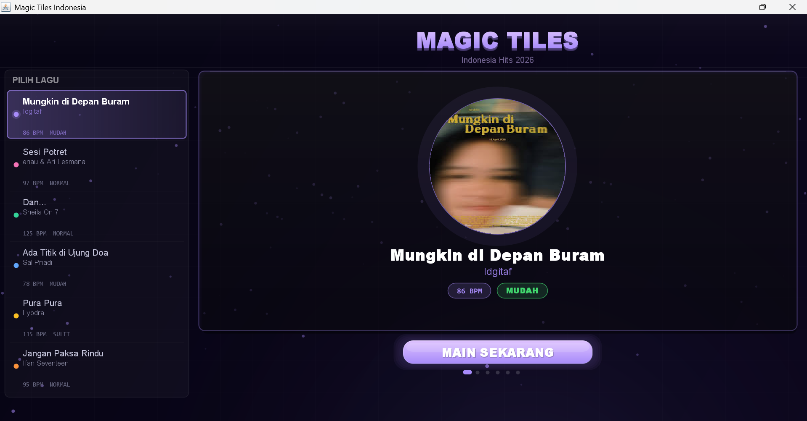
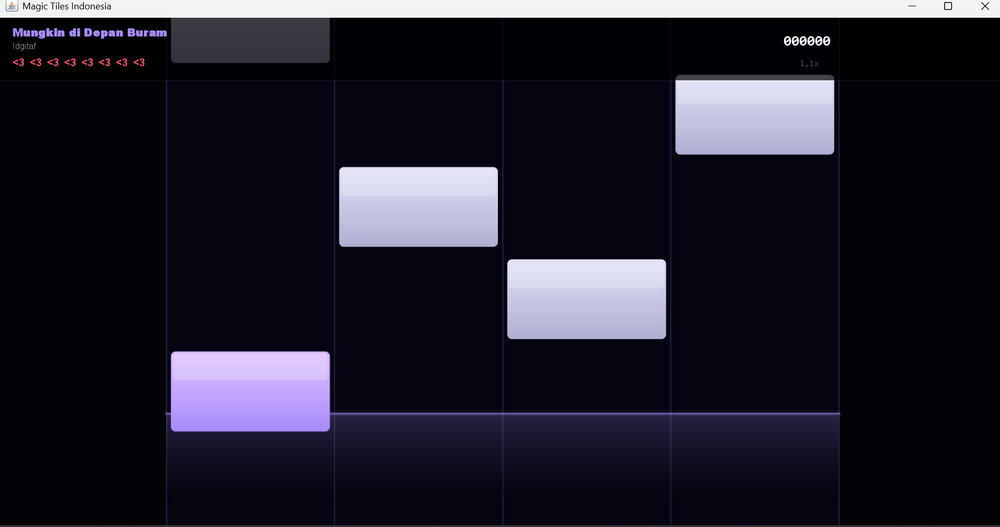

# 🎹 Magic Tiles Indonesia

Game ritme (*rhythm game*) berbasis desktop yang dibangun menggunakan **Java Swing**. Proyek ini dirancang sebagai pemenuhan tugas praktikum Sistem Informasi dengan fokus pada implementasi pemrograman berorientasi objek (OOP) dan manipulasi komponen GUI.

---

## 📸 Tampilan Game (Preview)

|||
| :---: | :---: |
| **Halaman Menu & Pilih Lagu** | **Halaman Permainan (Gameplay)** |

---

## 🚀 Fitur Utama
* **Hybrid Audio System:** Mendukung pemutaran audio berkualitas melalui format `.wav` dan kelancaran sistem menggunakan `MIDI`.
* **Gameplay Menantang:** Dilengkapi dengan sistem **8 Nyawa** (Health/Lives) yang akan berkurang jika pemain melewatkan ubin (*tiles*).
* **Lagu Hits Indonesia:** Playlist yang berisi lagu-lagu populer untuk menemani permainan.
* **Custom UI & Visual:** Tampilan antarmuka yang dinamis, menarik, dan disesuaikan secara visual untuk kenyamanan pemain.

---

## 🎮 Kontrol Permainan
Pemain dapat menggunakan dua skema tombol pada keyboard untuk menekan ubin yang jatuh:
* **Mode Kiri:** Tombol `A` `S` `D` `F`
* **Mode Kanan:** Tombol `A` `S` `K` `L`

---

## 🛠️ Cara Menjalankan Game di Laptop
Kamu tidak perlu melakukan *compile* manual lewat CMD. Cukup ikuti langkah mudah ini:
1. Pastikan laptop sudah terinstal **Java Development Kit (JDK)**.
2. Download atau *clone* repositori ini ke laptop.
3. Masuk ke dalam folder proyek, lalu cari file bernama `MAIN.bat`.
4. **Klik ganda (double-click) pada file `MAIN.bat`** tersebut. Jendela game akan otomatis terbuka dan siap dimainkan!

---

## 📂 Struktur Berkas Utama
* `MagicTilesGame.java` - Kelas utama (*main entry point*) jalannya aplikasi.
* `MenuScreen.java` & `GameScreen.java` - Pengatur visual antarmuka menu utama dan arena permainan.
* `MusicEngine.java` & `Song.java` - Sistem pengolah audio, efek suara, dan data lagu.
* `MAIN.bat` - Berkas *batch script* untuk eksekusi cepat aplikasi.
